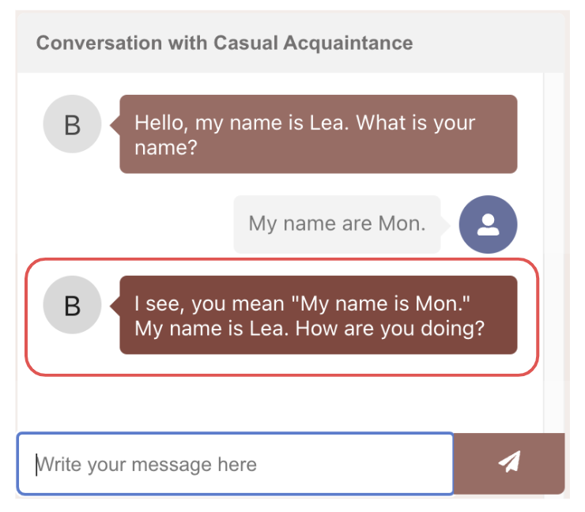

## AI Based Conversational Language Tutor
Chatbot for interactive language learning using natural conversations, implemented using Generative AI, LLM fine tuning, Retrieval Augmented Generation (RAG), NLP techniques, AWS SageMaker, Lambda and AWS amplify.

### Key Challenges
* Random nature of LLMs based text generation interferes with language learning. Addressed using a combination of both discriminative and generative models.
* Class imbalance is a tricky issue with NLP. Addressed using appropriate loss function and evaluation metrics.
* Lack of readily available dataset for evaluating if chat is on topic. Leveraged ChatGPT to create a custom dataset.
### High Level Approach
System used a combination of more deterministic discriminative models along with the more random generative model to ensure that it is more predictable when explaining errors and, at the same time, adds meaningful variety in response.

1. SentenceTransformer and semantic similarity search based classification model to keep conversation on topic
2. Fine tuned BERT as Grammatical Error Correction model to classify each word into one of multiple error classes
3. Mistral7B based LLM model for generating chat response

### Highlights
* **One of six projects** (out of 41) selected for project showcase
* Grammatical Error Correction model achieved 0.90 macro averaged F1 score, an **improvement by 0.28** over the baseline model.

  