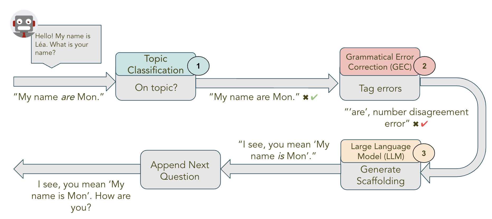
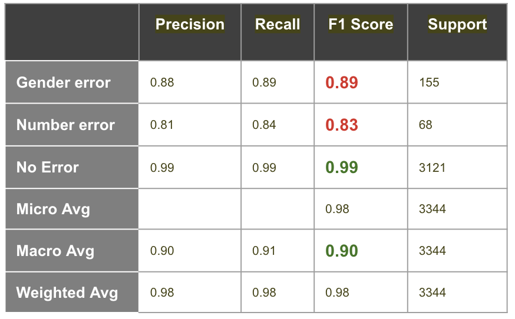
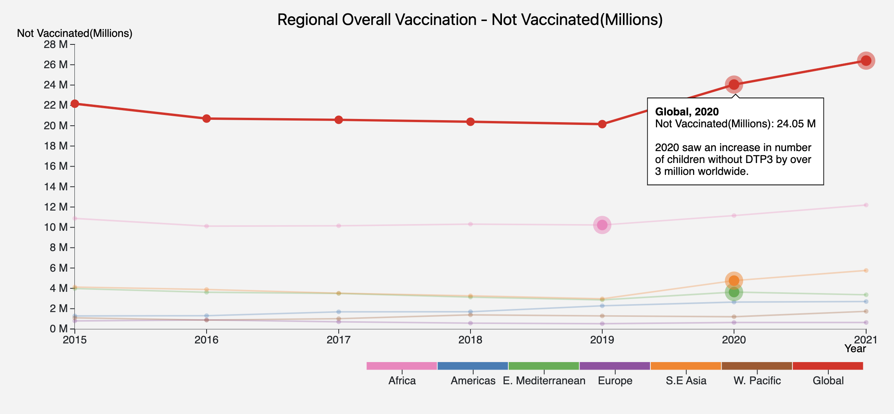
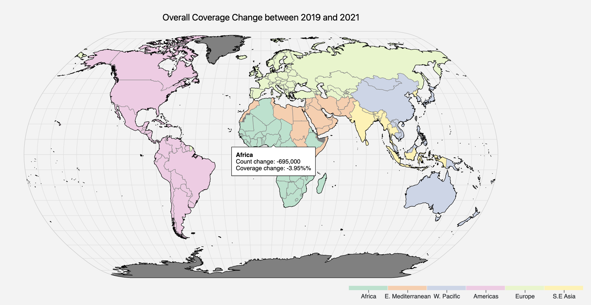
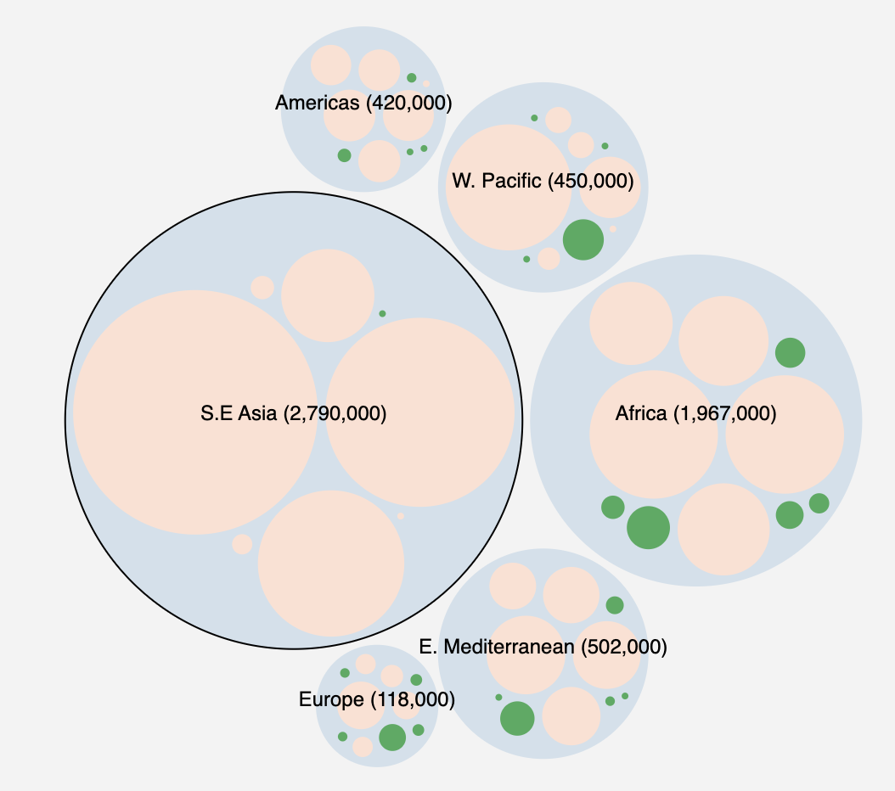

Ram is very passionate about solving real world problems with machines and data. He has 15+ years of software engineering experience in distributed systems, backend engineering, data engineering, ML engineering and big data. Last 5 years he was focused on large scale feature engineering, experimentation, machine learning, ML infrastructure and backend services.

This portfolio page has a compilation of projects done by him while doing the Masters in Information and Data Science (MIDS) degree from University of California, Berkeley.

<a href="pdf/resume.pdf" target="_top">Resume</a>
 
<a href="https://www.linkedin.com/in/ramsenth/" target="_top">LinkedIn Profile</a>

## Project Portfolio

### AI Based Conversational Language Tutor

Chatbot for interactive language learning using natural conversations, implemented using Generative AI, LLM fine tuning, Retrieval Augmented Generation (RAG), NLP techniques, AWS SageMaker, Lambda, AWS amplify, PyTorch, WandB, HuggingFace and LangChain.

<a href="pdf/capstone_presentation.pdf">Presentation Deck</a>

<b>High Level Approach</b>

System combined more deterministic discriminative models with more random generative models. with this approach, the system is more predictable when explaining errors and, at the same time, adds meaningful variety in chat response.

1. SentenceTransformer and semantic similarity search based classification model to keep conversation on topic
2. Fine tuned BERT as Grammatical Error Correction model to classify each word into one of multiple error classes
3. Mistral7B based LLM model for generating chat response

<b>Key Challenges</b>

* Random nature of LLMs based text generation interferes with language learning. Addressed using a combination of both discriminative and generative models.
* Class imbalance is a tricky issue with NLP. Addressed using appropriate loss function and evaluation metrics.
* Lack of readily available dataset for evaluating if chat is on topic. Leveraged ChatGPT to create a custom dataset.

<b>Highlights</b>

* **One of six projects** (out of 41) selected for project showcase
* Grammatical Error Correction model achieved 0.90 macro averaged F1 score, an **improvement by 0.28** over the baseline model.

  

### StoryBot: Interactive Story Generation For Kids
NLP sentence continuation model to enable an interactive story development experience for children.
This project involved fine tuning three transformer based models - one decoder only and two encoder/decoder - on sentence pairs from children story books.
 
<a href="pdf/storybot_presentation.pdf">Presentation Deck</a>
 
<a href="pdf/storybot_report.pdf">Final Report</a>

### Data Visualization:
A visual exploration of global trends in children vaccination with goal of understanding the challenges in achieving higher vaccination rates and identifying key insights that improve effectiveness of vaccination drives.
 
  
 
<a href="https://groups.ischool.berkeley.edu/VaxViz/">Website </a>
